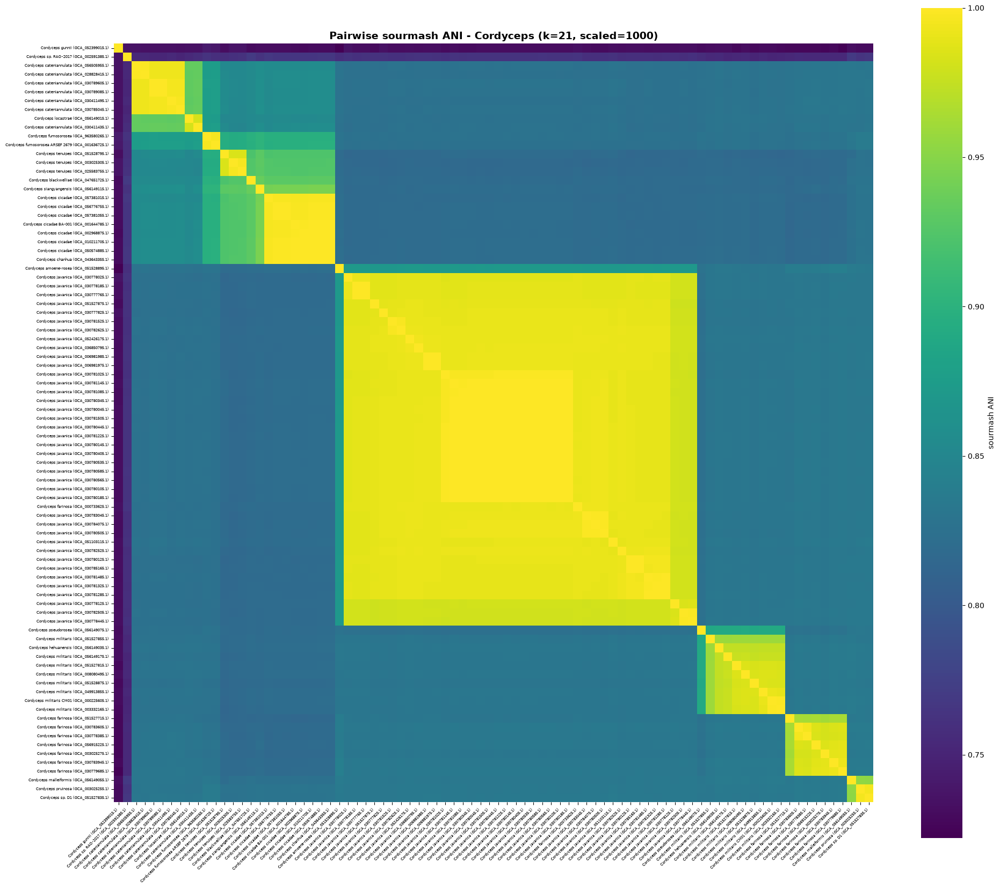
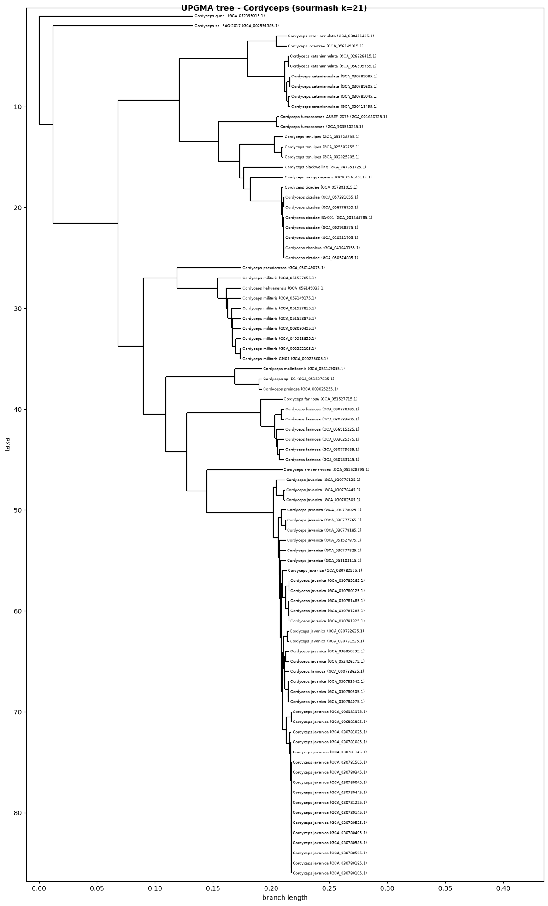

This repository contains supplemental data for the manuscript "Whole genome similarity provides a rapid, robust framework for classification of fungal taxa from the genus rank to intraspecies variants"

## Repository layout

- **`SupplementalData_Accessions_Trees_And_BUSCOdatabases/`** - tree files, genome
  accession lists, and other supporting data from the manuscript itself.

- **`ScriptsForAnalysis/`** - scripts and Jupyter notebooks to recreate the types of
  analysis done in the manuscript (BUSCO- and sourmash-based tree building,
  Robinson-Foulds tree comparisons, sourmash-vs-ANIb evolutionary path comparisons).
  Each subdirectory has its own `RunOrder.txt` explaining the order to run its
  scripts in.

- **`Tutorial_QuickStart_ANItree/`** - a short, self-contained walkthrough of the
  core workflow (download genomes &rarr; sketch sourmash signatures &rarr; compute
  pairwise ANI &rarr; heatmap &rarr; UPGMA tree) on a single example genus, with real
  executed outputs included in the notebook. Start here if you just want to see the
  method work end-to-end before diving into the full analyses above.

## Data availability note

The NCBI genome-catalog JSON snapshot used as input to the evolutionary-path analysis
(`ScriptsForAnalysis/SourmashAndANIb_Comparison/SpeciesGenusAnalysis/fungi_genome_summary_Apr14_2025.json`)
is not reproducibly regeneratable (NCBI's catalog grows over time) and is excluded
from this repository via `.gitignore`. It is archived on Zenodo instead
(DOI: TODO - add link here once the Zenodo deposit is live).

The full notebook (with all outputs) is also available as a standalone file: [`Tutorial_QuickStart_ANItree/Tutorial_MakeANItree_Cordyceps.ipynb`](Tutorial_QuickStart_ANItree/Tutorial_MakeANItree_Cordyceps.ipynb).

## Quick tutorial: building an ANI tree with sourmash

This is a short, self-contained walkthrough of the same basic workflow used throughout
`ScriptsForAnalysis/` in this repo: download genomes &rarr; sketch signatures &rarr; compute
pairwise ANI &rarr; visualize &rarr; build a tree.

We use *Cordyceps* (the entomopathogenic fungus genus that includes *C. militaris* and
relatives) here as an example genus with a good number of publicly available genome
assemblies - swap `GENUS` below for any other genus/species name to point this at a
different set of genomes.

If you re-run this yourself, NCBI's genome catalog may have added a few new assemblies
since this was last executed, so your exact genome count/tree may differ slightly.


```python
## Import libraries

import subprocess
import json
import shutil
import time
from pathlib import Path

import numpy as np
import pandas as pd
import matplotlib.pyplot as plt
import seaborn as sns
from scipy.cluster.hierarchy import linkage, leaves_list
from scipy.spatial.distance import squareform

from Bio import Phylo
from Bio.Phylo.TreeConstruction import DistanceMatrix, DistanceTreeConstructor

```


```python
## Configuration

DATASETS_TOOL = "/path/to/your/datasets_tool/datasets"   # NCBI datasets CLI
GENUS = "Cordyceps"

K = 21
SCALED = 1000

BASE_DIR = Path("/path/to/your/analysis_directory/Tutorial_Cordyceps_ANI")
GENOME_DIR = BASE_DIR / "genomes"
SIG_DIR = BASE_DIR / "signatures"
MATRIX_DIR = BASE_DIR / "matrices"

for d in (GENOME_DIR, SIG_DIR, MATRIX_DIR):
    d.mkdir(parents=True, exist_ok=True)

```

### Step 1: Download all available genomes for the genus

Query NCBI for every genome assembly under this genus, then download and extract each one.

Two things NCBI's genome catalog does that we need to handle:
- Some assemblies exist as a **GenBank/RefSeq pair** (a `GCA_...` and `GCF_...` accession pointing at the literal same assembly). We keep only the `GCA_` submission so we don't silently double-count one genome as two.
- A handful of assemblies are sometimes flagged **"atypical"** by NCBI (contamination/quality warnings). We pass `--exclude-atypical` and skip those entirely.


```python
## Look up every genome assembly available for this genus

summary_cmd = [DATASETS_TOOL, "summary", "genome", "taxon", GENUS,
               "--exclude-atypical", "--as-json-lines"]
result = subprocess.run(summary_cmd, capture_output=True, text=True, check=True)

records = [json.loads(line) for line in result.stdout.splitlines()]

genomes = {}
for r in records:
    acc = r["accession"]
    if not acc.startswith("GCA_"):
        # Skip GCF_ (RefSeq) entries - each one is paired with a GCA_ (GenBank) accession
        # for the exact same underlying assembly, so keeping both would double-count genomes.
        continue
    organism = r["organism"]["organism_name"]
    genomes[acc] = organism

print(f"Found {len(genomes)} unique, non-atypical genome assemblies for {GENUS}:")
for acc, organism in genomes.items():
    print(f"  {acc}\t{organism}")

```

    Found 86 unique, non-atypical genome assemblies for Cordyceps:
      GCA_051528895.1	Cordyceps amoene-rosea
      GCA_047651725.1	Cordyceps blackwelliae
      GCA_056505955.1	Cordyceps cateniannulata
      GCA_028828415.1	Cordyceps cateniannulata
      GCA_030411435.1	Cordyceps cateniannulata
      GCA_030411495.1	Cordyceps cateniannulata
      GCA_030785045.1	Cordyceps cateniannulata
      GCA_030789085.1	Cordyceps cateniannulata
      GCA_030789605.1	Cordyceps cateniannulata
      GCA_043643355.1	Cordyceps chanhua
      GCA_050574885.1	Cordyceps cicadae
      GCA_002968875.1	Cordyceps cicadae
      GCA_010211705.1	Cordyceps cicadae
      GCA_056776755.1	Cordyceps cicadae
      GCA_057381015.1	Cordyceps cicadae
      GCA_057381055.1	Cordyceps cicadae
      GCA_001644785.1	Cordyceps cicadae BA-001
      GCA_056915225.1	Cordyceps farinosa
      GCA_000733625.1	Cordyceps farinosa
      GCA_003025275.1	Cordyceps farinosa
      GCA_030778385.1	Cordyceps farinosa
      GCA_030779685.1	Cordyceps farinosa
      GCA_030783605.1	Cordyceps farinosa
      GCA_030783945.1	Cordyceps farinosa
      GCA_051527715.1	Cordyceps farinosa
      GCA_963580265.1	Cordyceps fumosorosea
      GCA_001636725.1	Cordyceps fumosorosea ARSEF 2679
      GCA_052399015.1	Cordyceps gunnii
      GCA_056149035.1	Cordyceps hehuanensis
      GCA_006981975.1	Cordyceps javanica
      GCA_006981985.1	Cordyceps javanica
      GCA_030777765.1	Cordyceps javanica
      GCA_030777825.1	Cordyceps javanica
      GCA_030778025.1	Cordyceps javanica
      GCA_030778125.1	Cordyceps javanica
      GCA_030778185.1	Cordyceps javanica
      GCA_030778445.1	Cordyceps javanica
      GCA_030780045.1	Cordyceps javanica
      GCA_030780105.1	Cordyceps javanica
      GCA_030780125.1	Cordyceps javanica
      GCA_030780145.1	Cordyceps javanica
      GCA_030780185.1	Cordyceps javanica
      GCA_030780345.1	Cordyceps javanica
      GCA_030780405.1	Cordyceps javanica
      GCA_030780445.1	Cordyceps javanica
      GCA_030780505.1	Cordyceps javanica
      GCA_030780535.1	Cordyceps javanica
      GCA_030780565.1	Cordyceps javanica
      GCA_030780585.1	Cordyceps javanica
      GCA_030781025.1	Cordyceps javanica
      GCA_030781085.1	Cordyceps javanica
      GCA_030781145.1	Cordyceps javanica
      GCA_030781225.1	Cordyceps javanica
      GCA_030781285.1	Cordyceps javanica
      GCA_030781325.1	Cordyceps javanica
      GCA_030781485.1	Cordyceps javanica
      GCA_030781505.1	Cordyceps javanica
      GCA_030781525.1	Cordyceps javanica
      GCA_030782505.1	Cordyceps javanica
      GCA_030782525.1	Cordyceps javanica
      GCA_030782625.1	Cordyceps javanica
      GCA_030783045.1	Cordyceps javanica
      GCA_030784075.1	Cordyceps javanica
      GCA_030785165.1	Cordyceps javanica
      GCA_036850795.1	Cordyceps javanica
      GCA_051103115.1	Cordyceps javanica
      GCA_051527875.1	Cordyceps javanica
      GCA_052426175.1	Cordyceps javanica
      GCA_056149015.1	Cordyceps locastrae
      GCA_056149055.1	Cordyceps malleiformis
      GCA_003332165.1	Cordyceps militaris
      GCA_008080495.1	Cordyceps militaris
      GCA_049913855.1	Cordyceps militaris
      GCA_051527815.1	Cordyceps militaris
      GCA_051527855.1	Cordyceps militaris
      GCA_051528875.1	Cordyceps militaris
      GCA_056149175.1	Cordyceps militaris
      GCA_000225605.1	Cordyceps militaris CM01
      GCA_003025255.1	Cordyceps pruinosa
      GCA_056149075.1	Cordyceps pseudorosea
      GCA_056149115.1	Cordyceps siangyangensis
      GCA_051527835.1	Cordyceps sp. D1
      GCA_002591385.1	Cordyceps sp. RAO-2017
      GCA_025583755.1	Cordyceps tenuipes
      GCA_003025305.1	Cordyceps tenuipes
      GCA_051528795.1	Cordyceps tenuipes


```python
## Download and extract each genome, renaming to <ACCESSION>_genomic.fna

for acc in genomes:
    fna_out = GENOME_DIR / f"{acc}_genomic.fna"
    if fna_out.exists():
        print(f"{acc}: already downloaded, skipping")
        continue

    zip_path = BASE_DIR / f"{acc}.zip"
    download_cmd = [DATASETS_TOOL, "download", "genome", "accession", acc,
                     "--filename", str(zip_path), "--exclude-atypical"]

    # NCBI occasionally drops a connection under back-to-back requests, so retry
    # a couple of times before giving up on an accession.
    for attempt in range(3):
        proc = subprocess.run(download_cmd, capture_output=True, text=True)
        if proc.returncode == 0:
            break
        print(f"{acc}: download attempt {attempt + 1} failed, retrying...")
        time.sleep(5)
    else:
        print(f"{acc}: FAILED after 3 attempts, skipping")
        continue

    extract_dir = BASE_DIR / f"extract_{acc}"
    shutil.unpack_archive(str(zip_path), str(extract_dir), format="zip")

    fna_src = next((extract_dir / "ncbi_dataset" / "data" / acc).glob("*.fna"))
    shutil.copy(fna_src, fna_out)

    shutil.rmtree(extract_dir)
    zip_path.unlink()
    print(f"{acc}: downloaded and extracted")

fna_files = sorted(GENOME_DIR.glob("*_genomic.fna"))
print(f"\n{len(fna_files)} genomes ready in {GENOME_DIR}")

```

    GCA_051528895.1: downloaded and extracted


    GCA_047651725.1: downloaded and extracted


    GCA_056505955.1: downloaded and extracted


    GCA_028828415.1: downloaded and extracted


    GCA_030411435.1: downloaded and extracted


    GCA_030411495.1: downloaded and extracted


    GCA_030785045.1: downloaded and extracted


    GCA_030789085.1: downloaded and extracted


    GCA_030789605.1: downloaded and extracted


    GCA_043643355.1: downloaded and extracted


    GCA_050574885.1: downloaded and extracted


    GCA_002968875.1: downloaded and extracted


    GCA_010211705.1: downloaded and extracted


    GCA_056776755.1: downloaded and extracted


    GCA_057381015.1: downloaded and extracted


    GCA_057381055.1: downloaded and extracted


    GCA_001644785.1: downloaded and extracted


    GCA_056915225.1: downloaded and extracted


    GCA_000733625.1: downloaded and extracted


    GCA_003025275.1: download attempt 1 failed, retrying...


    GCA_003025275.1: downloaded and extracted


    GCA_030778385.1: downloaded and extracted


    GCA_030779685.1: downloaded and extracted


    GCA_030783605.1: downloaded and extracted


    GCA_030783945.1: downloaded and extracted


    GCA_051527715.1: downloaded and extracted


    GCA_963580265.1: downloaded and extracted


    GCA_001636725.1: downloaded and extracted


    GCA_052399015.1: downloaded and extracted


    GCA_056149035.1: downloaded and extracted


    GCA_006981975.1: downloaded and extracted


    GCA_006981985.1: downloaded and extracted


    GCA_030777765.1: downloaded and extracted


    GCA_030777825.1: downloaded and extracted


    GCA_030778025.1: downloaded and extracted


    GCA_030778125.1: downloaded and extracted


    GCA_030778185.1: downloaded and extracted


    GCA_030778445.1: downloaded and extracted


    GCA_030780045.1: downloaded and extracted


    GCA_030780105.1: downloaded and extracted


    GCA_030780125.1: downloaded and extracted


    GCA_030780145.1: downloaded and extracted


    GCA_030780185.1: downloaded and extracted


    GCA_030780345.1: downloaded and extracted


    GCA_030780405.1: downloaded and extracted


    GCA_030780445.1: downloaded and extracted


    GCA_030780505.1: downloaded and extracted


    GCA_030780535.1: downloaded and extracted


    GCA_030780565.1: downloaded and extracted


    GCA_030780585.1: downloaded and extracted


    GCA_030781025.1: downloaded and extracted


    GCA_030781085.1: downloaded and extracted


    GCA_030781145.1: downloaded and extracted


    GCA_030781225.1: downloaded and extracted


    GCA_030781285.1: downloaded and extracted


    GCA_030781325.1: downloaded and extracted


    GCA_030781485.1: downloaded and extracted


    GCA_030781505.1: downloaded and extracted


    GCA_030781525.1: downloaded and extracted


    GCA_030782505.1: download attempt 1 failed, retrying...


    GCA_030782505.1: downloaded and extracted


    GCA_030782525.1: downloaded and extracted


    GCA_030782625.1: downloaded and extracted


    GCA_030783045.1: downloaded and extracted


    GCA_030784075.1: downloaded and extracted


    GCA_030785165.1: downloaded and extracted


    GCA_036850795.1: downloaded and extracted


    GCA_051103115.1: downloaded and extracted


    GCA_051527875.1: downloaded and extracted


    GCA_052426175.1: downloaded and extracted


    GCA_056149015.1: downloaded and extracted


    GCA_056149055.1: downloaded and extracted


    GCA_003332165.1: downloaded and extracted


    GCA_008080495.1: downloaded and extracted


    GCA_049913855.1: downloaded and extracted


    GCA_051527815.1: downloaded and extracted


    GCA_051527855.1: downloaded and extracted


    GCA_051528875.1: downloaded and extracted


    GCA_056149175.1: downloaded and extracted


    GCA_000225605.1: downloaded and extracted


    GCA_003025255.1: downloaded and extracted


    GCA_056149075.1: downloaded and extracted


    GCA_056149115.1: downloaded and extracted


    GCA_051527835.1: downloaded and extracted


    GCA_002591385.1: downloaded and extracted


    GCA_025583755.1: downloaded and extracted


    GCA_003025305.1: downloaded and extracted


    GCA_051528795.1: downloaded and extracted
    
    86 genomes ready in /path/to/your/analysis_directory/Tutorial_Cordyceps_ANI/genomes


### Step 2: Compute sourmash signatures

Sketch each genome assembly into a MinHash signature at a single k-mer size/scaled value.


```python
## Sketch a sourmash signature for every genome

for fna_file in fna_files:
    sig_path = SIG_DIR / f"{fna_file.stem}_k{K}.sig"
    if sig_path.exists():
        continue
    cmd = f"sourmash sketch dna -p k={K},scaled={SCALED} {fna_file} -o {sig_path}"
    subprocess.run(cmd, shell=True, check=True, capture_output=True)

sig_files = sorted(SIG_DIR.glob(f"*_k{K}.sig"))
print(f"Computed {len(sig_files)} signatures in {SIG_DIR}")

```

    Computed 86 signatures in /path/to/your/analysis_directory/Tutorial_Cordyceps_ANI/signatures


### Step 3: Compute pairwise ANI

`sourmash compare` builds an all-by-all similarity matrix from the signatures directly; passing `--ani` converts the raw Jaccard/containment values into an ANI estimate.


```python
## Compute the pairwise ANI matrix

sig_list_file = MATRIX_DIR / "all_signatures.txt"
with open(sig_list_file, "w") as f:
    for sig_file in sig_files:
        f.write(f"{sig_file}\n")

matrix_out = MATRIX_DIR / f"ani_k{K}.npy"
compare_cmd = (f"sourmash compare --from-file {sig_list_file} -k {K} --ani --quiet -o {matrix_out}")
subprocess.run(compare_cmd, shell=True, check=True, capture_output=True)
print(f"ANI matrix saved to: {matrix_out}")

ani_matrix = np.load(matrix_out)

labels_file = Path(str(matrix_out) + ".labels.txt")
with open(labels_file) as f:
    raw_labels = [line.strip() for line in f]

# sourmash labels each row/column with the signature filepath - parse back out just the accession
accessions = ["_".join(Path(label).stem.split("_")[:2]) for label in raw_labels]
display_labels = [f"{genomes[acc]} ({acc})" for acc in accessions]

ani_df = pd.DataFrame(ani_matrix, index=display_labels, columns=display_labels)
ani_df.round(4)

```

    ANI matrix saved to: /path/to/your/analysis_directory/Tutorial_Cordyceps_ANI/matrices/ani_k21.npy


<div>
<style scoped>
    .dataframe tbody tr th:only-of-type {
        vertical-align: middle;
    }

    .dataframe tbody tr th {
        vertical-align: top;
    }

    .dataframe thead th {
        text-align: right;
    }
</style>
<table border="1" class="dataframe">
  <thead>
    <tr style="text-align: right;">
      <th></th>
      <th>Cordyceps javanica (GCA_030780405.1)</th>
      <th>Cordyceps javanica (GCA_030781225.1)</th>
      <th>Cordyceps javanica (GCA_030782525.1)</th>
      <th>Cordyceps farinosa (GCA_000733625.1)</th>
      <th>Cordyceps javanica (GCA_030780535.1)</th>
      <th>Cordyceps cateniannulata (GCA_030411495.1)</th>
      <th>Cordyceps cicadae (GCA_057381015.1)</th>
      <th>Cordyceps javanica (GCA_030778025.1)</th>
      <th>Cordyceps javanica (GCA_030780585.1)</th>
      <th>Cordyceps javanica (GCA_030780045.1)</th>
      <th>...</th>
      <th>Cordyceps javanica (GCA_030778125.1)</th>
      <th>Cordyceps javanica (GCA_030780145.1)</th>
      <th>Cordyceps farinosa (GCA_056915225.1)</th>
      <th>Cordyceps sp. D1 (GCA_051527835.1)</th>
      <th>Cordyceps gunnii (GCA_052399015.1)</th>
      <th>Cordyceps javanica (GCA_030780445.1)</th>
      <th>Cordyceps javanica (GCA_051527875.1)</th>
      <th>Cordyceps blackwelliae (GCA_047651725.1)</th>
      <th>Cordyceps javanica (GCA_006981975.1)</th>
      <th>Cordyceps javanica (GCA_030781285.1)</th>
    </tr>
  </thead>
  <tbody>
    <tr>
      <th>Cordyceps javanica (GCA_030780405.1)</th>
      <td>1.0000</td>
      <td>0.9997</td>
      <td>0.9921</td>
      <td>0.9914</td>
      <td>0.9997</td>
      <td>0.8262</td>
      <td>0.8200</td>
      <td>0.9878</td>
      <td>0.9997</td>
      <td>0.9995</td>
      <td>...</td>
      <td>0.9807</td>
      <td>0.9997</td>
      <td>0.8340</td>
      <td>0.8342</td>
      <td>0.7312</td>
      <td>0.9996</td>
      <td>0.9896</td>
      <td>0.8191</td>
      <td>0.9917</td>
      <td>0.9900</td>
    </tr>
    <tr>
      <th>Cordyceps javanica (GCA_030781225.1)</th>
      <td>0.9997</td>
      <td>1.0000</td>
      <td>0.9920</td>
      <td>0.9914</td>
      <td>0.9997</td>
      <td>0.8261</td>
      <td>0.8197</td>
      <td>0.9878</td>
      <td>0.9997</td>
      <td>0.9995</td>
      <td>...</td>
      <td>0.9807</td>
      <td>0.9997</td>
      <td>0.8341</td>
      <td>0.8345</td>
      <td>0.7312</td>
      <td>0.9996</td>
      <td>0.9897</td>
      <td>0.8191</td>
      <td>0.9917</td>
      <td>0.9899</td>
    </tr>
    <tr>
      <th>Cordyceps javanica (GCA_030782525.1)</th>
      <td>0.9921</td>
      <td>0.9920</td>
      <td>1.0000</td>
      <td>0.9910</td>
      <td>0.9920</td>
      <td>0.8260</td>
      <td>0.8175</td>
      <td>0.9879</td>
      <td>0.9920</td>
      <td>0.9920</td>
      <td>...</td>
      <td>0.9800</td>
      <td>0.9921</td>
      <td>0.8327</td>
      <td>0.8347</td>
      <td>0.7310</td>
      <td>0.9920</td>
      <td>0.9894</td>
      <td>0.8183</td>
      <td>0.9912</td>
      <td>0.9924</td>
    </tr>
    <tr>
      <th>Cordyceps farinosa (GCA_000733625.1)</th>
      <td>0.9914</td>
      <td>0.9914</td>
      <td>0.9910</td>
      <td>1.0000</td>
      <td>0.9913</td>
      <td>0.8246</td>
      <td>0.8190</td>
      <td>0.9884</td>
      <td>0.9913</td>
      <td>0.9912</td>
      <td>...</td>
      <td>0.9808</td>
      <td>0.9913</td>
      <td>0.8333</td>
      <td>0.8341</td>
      <td>0.7332</td>
      <td>0.9912</td>
      <td>0.9895</td>
      <td>0.8200</td>
      <td>0.9908</td>
      <td>0.9909</td>
    </tr>
    <tr>
      <th>Cordyceps javanica (GCA_030780535.1)</th>
      <td>0.9997</td>
      <td>0.9997</td>
      <td>0.9920</td>
      <td>0.9913</td>
      <td>1.0000</td>
      <td>0.8261</td>
      <td>0.8199</td>
      <td>0.9878</td>
      <td>0.9997</td>
      <td>0.9995</td>
      <td>...</td>
      <td>0.9807</td>
      <td>0.9997</td>
      <td>0.8341</td>
      <td>0.8342</td>
      <td>0.7312</td>
      <td>0.9996</td>
      <td>0.9896</td>
      <td>0.8189</td>
      <td>0.9917</td>
      <td>0.9899</td>
    </tr>
    <tr>
      <th>...</th>
      <td>...</td>
      <td>...</td>
      <td>...</td>
      <td>...</td>
      <td>...</td>
      <td>...</td>
      <td>...</td>
      <td>...</td>
      <td>...</td>
      <td>...</td>
      <td>...</td>
      <td>...</td>
      <td>...</td>
      <td>...</td>
      <td>...</td>
      <td>...</td>
      <td>...</td>
      <td>...</td>
      <td>...</td>
      <td>...</td>
      <td>...</td>
    </tr>
    <tr>
      <th>Cordyceps javanica (GCA_030780445.1)</th>
      <td>0.9996</td>
      <td>0.9996</td>
      <td>0.9920</td>
      <td>0.9912</td>
      <td>0.9996</td>
      <td>0.8258</td>
      <td>0.8199</td>
      <td>0.9877</td>
      <td>0.9996</td>
      <td>0.9995</td>
      <td>...</td>
      <td>0.9807</td>
      <td>0.9997</td>
      <td>0.8343</td>
      <td>0.8340</td>
      <td>0.7312</td>
      <td>1.0000</td>
      <td>0.9895</td>
      <td>0.8184</td>
      <td>0.9916</td>
      <td>0.9899</td>
    </tr>
    <tr>
      <th>Cordyceps javanica (GCA_051527875.1)</th>
      <td>0.9896</td>
      <td>0.9897</td>
      <td>0.9894</td>
      <td>0.9895</td>
      <td>0.9896</td>
      <td>0.8249</td>
      <td>0.8186</td>
      <td>0.9873</td>
      <td>0.9896</td>
      <td>0.9896</td>
      <td>...</td>
      <td>0.9794</td>
      <td>0.9896</td>
      <td>0.8323</td>
      <td>0.8334</td>
      <td>0.7290</td>
      <td>0.9895</td>
      <td>1.0000</td>
      <td>0.8191</td>
      <td>0.9900</td>
      <td>0.9893</td>
    </tr>
    <tr>
      <th>Cordyceps blackwelliae (GCA_047651725.1)</th>
      <td>0.8191</td>
      <td>0.8191</td>
      <td>0.8183</td>
      <td>0.8200</td>
      <td>0.8189</td>
      <td>0.8542</td>
      <td>0.9291</td>
      <td>0.8180</td>
      <td>0.8189</td>
      <td>0.8188</td>
      <td>...</td>
      <td>0.8190</td>
      <td>0.8186</td>
      <td>0.8183</td>
      <td>0.8292</td>
      <td>0.7303</td>
      <td>0.8184</td>
      <td>0.8191</td>
      <td>1.0000</td>
      <td>0.8182</td>
      <td>0.8189</td>
    </tr>
    <tr>
      <th>Cordyceps javanica (GCA_006981975.1)</th>
      <td>0.9917</td>
      <td>0.9917</td>
      <td>0.9912</td>
      <td>0.9908</td>
      <td>0.9917</td>
      <td>0.8261</td>
      <td>0.8186</td>
      <td>0.9883</td>
      <td>0.9917</td>
      <td>0.9916</td>
      <td>...</td>
      <td>0.9804</td>
      <td>0.9917</td>
      <td>0.8344</td>
      <td>0.8352</td>
      <td>0.7320</td>
      <td>0.9916</td>
      <td>0.9900</td>
      <td>0.8182</td>
      <td>1.0000</td>
      <td>0.9901</td>
    </tr>
    <tr>
      <th>Cordyceps javanica (GCA_030781285.1)</th>
      <td>0.9900</td>
      <td>0.9899</td>
      <td>0.9924</td>
      <td>0.9909</td>
      <td>0.9899</td>
      <td>0.8259</td>
      <td>0.8191</td>
      <td>0.9883</td>
      <td>0.9900</td>
      <td>0.9899</td>
      <td>...</td>
      <td>0.9807</td>
      <td>0.9900</td>
      <td>0.8331</td>
      <td>0.8343</td>
      <td>0.7329</td>
      <td>0.9899</td>
      <td>0.9893</td>
      <td>0.8189</td>
      <td>0.9901</td>
      <td>1.0000</td>
    </tr>
  </tbody>
</table>
<p>86 rows × 86 columns</p>
</div>


### Step 4: Heatmap of pairwise ANI

Reorder the rows/columns by average-linkage clustering on the same ANI-derived distances used for the tree in the next step, then plot the heatmap.


```python
## Reorder genomes by average-linkage clustering, then plot the ANI heatmap

condensed_dist = squareform(1 - ani_matrix, checks=False)
linkage_matrix = linkage(condensed_dist, method="average")
order = leaves_list(linkage_matrix)

ani_df_ordered = ani_df.iloc[order, order]

fig, ax = plt.subplots(figsize=(20, 17))
sns.heatmap(ani_df_ordered, cmap="viridis", vmin=ani_df.values.min(), vmax=1.0,
            square=True, xticklabels=True, yticklabels=True,
            cbar_kws={"label": "sourmash ANI"}, ax=ax)
ax.set_title(f"Pairwise sourmash ANI - {GENUS} (k={K}, scaled={SCALED})", fontsize=14, fontweight="bold")
plt.setp(ax.get_xticklabels(), rotation=45, ha="right", fontsize=5)
plt.setp(ax.get_yticklabels(), fontsize=5)
plt.tight_layout()
plt.show()

```


    

    


### Step 5: Build a UPGMA tree

Convert the ANI matrix to a distance matrix (`1 - ANI`) and cluster it with UPGMA, the same approach used for the sourmash trees throughout this repo.


```python
## Build and draw a UPGMA tree from the ANI-derived distances

dist_matrix_full = 1 - ani_matrix

# BioPython's DistanceMatrix wants a lower-triangular condensed matrix
condensed = [dist_matrix_full[i, :i + 1].tolist() for i in range(len(dist_matrix_full))]
bio_dist_matrix = DistanceMatrix(names=display_labels, matrix=condensed)

constructor = DistanceTreeConstructor()
upgma_tree = constructor.upgma(bio_dist_matrix)
upgma_tree.ladderize()

tree_out = MATRIX_DIR / f"upgma_tree_k{K}.newick"
Phylo.write(upgma_tree, str(tree_out), "newick")
print(f"Tree saved to: {tree_out}")

def hide_inner_labels(clade):
    return clade.name if clade.is_terminal() else None

fig = plt.figure(figsize=(12, 20))
ax = fig.add_subplot(1, 1, 1)
Phylo.draw(upgma_tree, axes=ax, do_show=False, label_func=hide_inner_labels)
for text in ax.texts:
    text.set_fontsize(6)
ax.set_xlim(right=ax.get_xlim()[1] * 1.6)  # leave room for full tip labels
fig.suptitle(f"UPGMA tree - {GENUS} (sourmash k={K})", fontsize=12, fontweight="bold")
plt.tight_layout()
plt.show()

```

    Tree saved to: /path/to/your/analysis_directory/Tutorial_Cordyceps_ANI/matrices/upgma_tree_k21.newick


    

    

